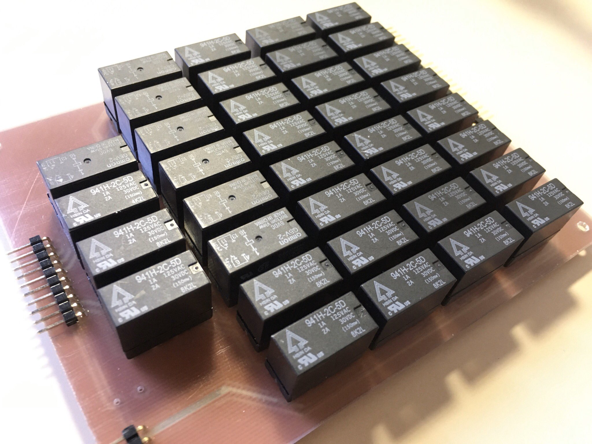
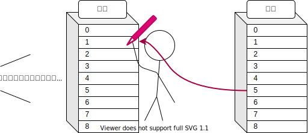

# リレーコンピュータ

現代のコンピュータは半導体によって作られていますが、実は半導体が登場する数十年前からコンピュータはありました。リレーコンピュータはそんな前半導体時代のコンピュータのひとつです。[^0]

[^0]: 正確には電子計算機といったほうがよろしいでしょう。というのも、コンピュータという言葉は電子計算機だけではなく、広く「計算する者」を指す言葉だからです。20世紀の中頃まで、計算は人間によって行われており、計算を専業とする人はコンピュータと呼ばれていました。[計算手](https://www.history.com/news/human-computers-women-at-nasa)

## リレーとは？

電磁石で動くスイッチです。[^1]

電磁石に電流が流れると、電磁力によってスイッチが入ります。電流が切れると、ばねの力[^2]によってスイッチが切れます。

[^1]: 論理回路の素子として必要な性質は「電気で制御可能なスイッチ」であることです。
[^2]: 図ではコイルばねとして描かれていますが、実際はスイッチの可動部を板バネとして利用しているものが大半です。

## リレーコンピュータのしくみ

### 登場人物

時系列でみていきます。

### 1. クロックジェネレータ

電源を入れると、まずクロックジェネレータが動きだし、クロック信号を生成します。

リレーが OFF 状態のときは、コンデンサに充電され、リレーのコイルにかかる電圧は上昇します。リレーの閾電圧に達したとき、リレーが ON 状態になり、電源の供給が絶たれます。コンデンサに蓄えられた電荷によって、しばらくリレーは ON 状態にありますが、コンデンサの放電が進み電圧が下がるとリレーが OFF 状態になり、最初の状態に戻ります。

### 2. プログラムカウンタ

クロック信号のパルスが来るごとに、カウントアップします。

### 3. プログラムメモリ

プログラムカウンタの番地に書いてある命令を取り出します。

### 4. 命令デコーダ

命令を読み解いて，指示をだします．

|             | 命令の種類 | 引数 1   | 引数 2   |
| ----------- | ---------- | -------- | -------- |
|             | 2 ビット   | 8 ビット | 8 ビット |
| NoOperation | 00         | -        | -        |
| JumpIf      | 01         | 分岐条件 | 分岐先   |
| Move        | 10         | 参照元   | 書込先   |
| Load        | 11         | 即値     | 書込先   |

### 5. 命令の実行

命令の内容に応じていろいろな動作をします．

#### (0) NoOperation

何もしません。１クロックの時間を無為に過ごします。

#### (1) JumpIf

プログラムの分岐とジャンプを行います。

条件演算器では、8 ビットで表された分岐条件と、4 ビットのフラグ信号から、分岐するか否かを計算します。分岐条件の 1 つめのビットはフラグを使用するか否かを表していて、2 つめのビットはどちらに一致するかを表しています。

| 分岐条件 | 00  | 01  | 10  |     | 11  |     |
| -------- | --- | --- | --- | --- | --- | --- |
| フラグ   |     |     | 0   | 1   | 0   | 1   |
| 結果     | 1   | 1   | 1   | 0   | 0   | 1   |

4 ビット全てのフラグについての計算結果を AND してジャンプするか否かを決定します。つまり、全ての計算結果が 1 の場合にジャンプします。

ジャンプすることが決定したら、プログラムカウンタを書き換えます。プログラムカウンタは、次に実行する命令のアドレス（行数）を示しているので、プログラムカウンタを書き換えると、ジャンプができます。

#### (2) Move

結果表のある行から値を読み取って、入力表のある行に書き込みます。

#### (3) Load

指定された値（即値）を、入力表のある行に書き込みます。

### 5. 裏方の仕事

裏方は入力表を監視しています。裏方は自分の担当の行に変化があれば、計算をして、計算結果を出力表に書きます。

### 6. そして次の命令へ

## それぞれの回路のしくみ

### 1. クロックジェネレータ

クロック信号を生成する回路です。

リレーが OFF 状態のときは、コンデンサに充電され、リレーのコイルにかかる電圧は上昇します。リレーの閾電圧に達したとき、リレーが ON 状態になり、電源の供給が絶たれます。コンデンサに蓄えられた電荷によって、しばらくリレーは ON 状態にありますが、コンデンサの放電が進み電圧が下がるとリレーが OFF 状態になり、最初の状態に戻ります。

### 2. プログラムカウンタ

### 3. プログラムメモリ

### 4. 命令デコーダ

### 5. 分岐条件演算器

### 6. 入力表

### 7. 出力表

## アーキテクチャの特徴

| Function | OP  | OPR1       | OPR2          |
| -------- | --- | ---------- | ------------- |
| NOP      | 00  | -          | -             |
| JMPIF    | 01  | Condition  | JumpTo        |
| MOV      | 10  | SourceAddr | DirectionAddr |
| LOAD     | 11  | Immidiate  | DirectionAddr |

### 演算装置を CPU から追放

- 演算装置をアドレス空間上に配置
- 演算は演算装置のアドレスから/への Move 命令で行う

### 命令セットの小型化

- 演算系の命令が一掃された
- CPU はアドレス空間上で値を動かす装置となった

### 疑似的な並列化

- 1 クロックのうちに演算を終わらせる必要が無くなった

### アクセラレータの追加

- 空いてるアドレスに回路を追加できる
- アドレス空間をインターフェースとして，機能を拡張できる

### ソフトとハードの双対性

- ハードウェア構成を簡単に変えられるコンピュータである
- ソフトウェアには，どんな構成のハードウェアをターゲットとしているかメモしておく必要がある
- 逆に，同じソフトウェアでも，ハードウェア構成を変えることで，圏論的な変換ができる

## 小噺

### 計算機って何？ 計算って何？

とりあえず，脳内で以下の作業をしてみてください．

最後に持っている大福の数が 3 × 2 の答えになっていますが[^2]、さて、この作業をした人は掛け算を理解しているでしょうか。掛け算を知らない人がこの作業をできるでしょうか。

[^2]: なぜこんなにまわりくどい方法をとっているのか．それは数や計算というのが抽象的な概念だからです．「2 つの大福」を手に取ることはできても，そこから「大福」を取り除いた「2 つ」を手にすることはできません．物理的実体のない「数」を，機械が扱える形に現すために，「2」を大福に憑依させているのです．そういう意味で，数は関数です．「2(x)」という関数は「2 つの x」という実体を返します．この関数は入れ子にすることができます．「3(2(x)) = 3(2 つの x) = 6 つの x」．つまりこれは「3(2(x)) = 6(x)」を表しています．これが，物理的実体に根ざした掛け算です．

掛け算を理解していなくとも、この作業を実行できます。この作業に必要なスキルと、掛け算のスキルは異なるからです。

実はコンピュータも掛け算はおろか、数すらをも理解せずに掛け算を計算しています。

### 無能か万能か

掛け算のかわりに足し算を繰り返すといったように、ある計算は、別の計算で置き換えることができます。チューリングは、この置き換えを究極的に突き詰めた結果、あらゆる計算を実行するために必要な最小限の計算だけができる機械、「チューリングマシン」を発明しました。「計算とは何か？」という問いに対してチューリングは、「最低限これができること」と答えたわけです。[^3]

[^3]: この問題に「計算とはラムダ計算だ」と答えたのがアメリカの数学者，アロンゾ・チャーチです．彼は，数と関数を同一視する「ラムダ式」という概念を作り，そこに「ラムダ式の簡約」を定義しました．「計算とは何か？」という問いに，チューリングはチューリングマシン，チャーチはラムダ計算と，全く別のアプローチで解答したわけですが，両者が実は同値であるということが証明されます．「計算」の盤石な定義を得た人類は計算機科学を発展させていくこととなるのです．

チューリングマシンはどんな計算も実行できます。しかしそのためには、実行したい計算を、チューリングマシンが実行可能な計算の組み合わせとして再構築する必要があります。[^4]

[^4]: チューリングマシンは万能ではありますが、できることが極端に少ないため、プログラミングが大変です。発狂してみたい方は Brainf\*ck という言語で遊んでみてください。[ウェブブラウザで動くBrainfuck](https://kachikachi.net/brainfuck/)

「利用可能な計算の組み合わせてとして計算を再構築する」という考え方は、プログラミングの本質です。

CPU単体では、ただ足し算をしたり、メモリの値を移動したりといった単純な操作しかできません。しかし、プログラムを与えることで、より複雑な操作ができるようになります。プログラムがコンピュータの能力を拡張しているとも言えます。

### このリレーコンピュータの特殊性

がプログラミングなわけですが，

## あとがき

こんな読みにくい文章に最後までお付き合いいただきたきありがとうございます。

ご質問などございましたら、気軽に [Twitter](https://twitter.com/messages/compose?recipient_id=887284383534600192) までどうぞ。

2021-10-02 [@kanade_k_1228](https://twitter.com/kanade_k_1228)

## 文献

- [Harry Porter's Relay Computer](http://web.cecs.pdx.edu/~harry/Relay/)
  - リレーコンピュータについての（ネット上でおそらく唯一の）教科書
- [作ろう! CPU](https://www.amazon.co.jp/dp/4839968519/)
  - 論理回路をグラフとして扱うことで，Bool 代数に起因していた無理を解消している．順序回路がいまいちよく分からない人におすすめ．

